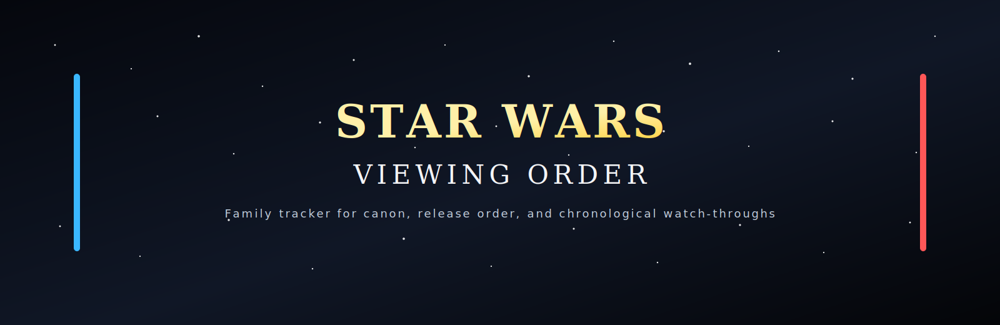
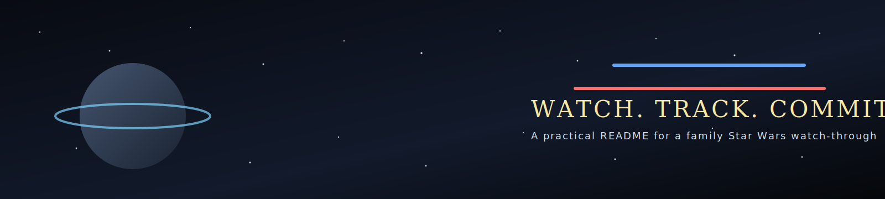

<div align="center">
  
  <h1>Star Wars Viewing Order</h1>
  <p><strong>A family-friendly Star Wars viewing tracker with canon, release-order, and expanded chronological guides in one README.</strong></p>
  <p>Built for watching Star Wars with my kids, tracking progress together, and using each update as a small Git commit lesson.</p>
  <p>
    <a href="https://github.com/ericchapman80/star-wars-viewing-order/stargazers">
      
    </a>
    <a href="https://github.com/ericchapman80/star-wars-viewing-order/commits/main">
      
    </a>
    <a href="https://github.com/sponsors/ericchapman80">
      
    </a>
  </p>
  <!-- stats-badges:start -->
<p>
  
  
  
</p>
<!-- stats-badges:end -->
</div>

## Table of Contents

- [Why This Repo Exists](#why-this-repo-exists)
- [Our Family Progress Tracker](#our-family-progress-tracker)
- [Progress Snapshot](#progress-snapshot)
- [How We Use It](#how-we-use-it)
- [Fork and Sync](#fork-and-sync)
- [Dynamic Stats and Automation](#dynamic-stats-and-automation)
- [Canon-Only Recommended Order](#canon-only-recommended-order)
- [Release Order Reference](#release-order-reference)
- [Expanded Chronological Guide](#expanded-chronological-guide)
- [Announced and Upcoming Projects](#announced-and-upcoming-projects)
- [Accuracy Notes](#accuracy-notes)
- [Support This Project](#support-this-project)
- [Image Credits and Sources](#image-credits-and-sources)

## Why This Repo Exists

This repo started as a simple way to track a Star Wars watch-through with my kids.

We wanted to work through the saga in chronological order, keep our place, and use the checklist as a practical way to teach basic Git habits like editing a file, making a commit, and building progress over time.

If you found this repo because you were searching for a **Star Wars viewing order**, **chronological Star Wars watch order**, or a **Star Wars release order tracker**, that is exactly what this project is designed to help with.

## Our Family Progress Tracker

This is the checklist we actually update as we watch. The reference sections below stay untracked on purpose so they remain easy to compare against official guidance.

### Current Watch Path

<!-- family-tracker:start -->
- [ ] **The Acolyte**
- [x] **Star Wars Episode I: The Phantom Menace**
- [x] **Star Wars Episode II: Attack of the Clones**
- [x] **Lego Star Wars: The Yoda Chronicles**
- [x] **Lego Star Wars: The Padawan Menace**
- [x] **Star Wars: The Clone Wars** animated movie
- [x] **Star Wars: The Clone Wars** series
- [ ] **Tales of the Jedi**
- [x] **Star Wars Episode III: Revenge of the Sith**
- [ ] **Tales of the Empire**
- [ ] **Tales of the Underworld**
- [ ] **Star Wars: Maul - Shadow Lord**
- [x] **Star Wars: The Bad Batch**
- [x] **Solo: A Star Wars Story**
- [x] **Obi-Wan Kenobi**
- [ ] **Andor**
- [x] **Star Wars: Rebels**
- [x] **Rogue One: A Star Wars Story**
- [x] **Star Wars: Droids**
- [x] **Star Wars Episode IV: A New Hope**
- [x] **Star Wars Holiday Special**
- [x] **Lego Star Wars: The Empire Strikes Out**
- [x] **Star Wars Episode V: The Empire Strikes Back**
- [x] **Star Wars Episode VI: Return of the Jedi**
- [x] **Lego Star Wars: The Freemaker Adventures**
- [x] **Lego Star Wars: Droid Tales**
- [ ] **Ewoks**
- [x] **The Mandalorian**
- [x] **The Book of Boba Fett**
- [ ] **Ahsoka**
- [ ] **Skeleton Crew**
- [x] **Star Wars: Resistance**
- [x] **Lego Star Wars: The Resistance Rises**
- [ ] **Star Wars Episode VII: The Force Awakens**
- [ ] **Star Wars Episode VIII: The Last Jedi**
- [ ] **Star Wars Episode IX: The Rise of Skywalker**
- [ ] **The Mandalorian and Grogu**
- [ ] **Star Wars: Starfighter**
- [ ] **Star Wars: Forces of Destiny**
- [ ] **Star Wars: Visions Presents - The Ninth Jedi**
<!-- family-tracker:end -->

## Progress Snapshot

<!-- progress-table:start -->
| Collection | Watched | Total | Progress |
| --- | ---: | ---: | ---: |
| Family tracker | 24 | 40 | 60% |
| Canon core tracker | 16 | 29 | 55% |
| Skywalker Saga films | 6 | 9 | 67% |
| Lego, legacy, and bonus extras | 8 | 11 | 73% |
<!-- progress-table:end -->

## How We Use It

1. Watch the next title in the family checklist.
2. Change `[ ]` to `[x]` when finished.
3. Commit the update so the kids can see progress in Git history.

Example:

```bash
git add README.md
git commit -m "Mark Andor as watched"
```

The progress badges and snapshot table above can be updated automatically by running:

```bash
python3 scripts/update_readme_stats.py
```

## Fork and Sync

If you want to track your own family progress and still pick up new titles or ordering fixes from this project, the right workflow is to **fork first, then clone your fork**.

### 1. Fork the repo on GitHub

Create your own copy of:

- `https://github.com/ericchapman80/star-wars-viewing-order`

### 2. Clone your fork

Replace `YOUR_USERNAME` with your GitHub username:

```bash
git clone git@github.com:YOUR_USERNAME/star-wars-viewing-order.git
cd star-wars-viewing-order
```

### 3. Add the original repo as `upstream`

```bash
git remote add upstream git@github.com:ericchapman80/star-wars-viewing-order.git
git remote -v
```

### 4. Track your watch progress in your fork

Update the family checklist in `README.md`, then commit your progress:

```bash
python3 scripts/update_readme_stats.py
git add README.md
git commit -m "Mark Ahsoka as watched"
git push origin main
```

### 5. Pull in future upstream updates

When this repo gets new entries, order fixes, or README improvements, sync your fork like this:

```bash
git fetch upstream
git checkout main
git merge upstream/main
git push origin main
```

This keeps your personal tracker while still letting you inherit updates from the source repo.

## Dynamic Stats and Automation

This repo includes a small automation layer so the progress badges and snapshot table stay aligned with the checklist.

### How the dynamic stats work

- The family checklist in [README.md](/Users/chapman/projects/star-wars-viewing-order/README.md) is the source of truth.
- [update_readme_stats.py](/Users/chapman/projects/star-wars-viewing-order/scripts/update_readme_stats.py) reads the checklist entries between the `family-tracker` markers.
- The script recalculates `Family tracker`, `Canon core tracker`, `Skywalker Saga films`, and `Lego, legacy, and bonus extras`.
- It then rewrites the badge block and the `Progress Snapshot` table in the README.

### Run it locally

After changing any checklist item from `[ ]` to `[x]`, run:

```bash
python3 scripts/update_readme_stats.py
```

Then commit the updated `README.md`.

### GitHub Action

This repo also includes a GitHub Action at [update-readme-stats.yml](/Users/chapman/projects/star-wars-viewing-order/.github/workflows/update-readme-stats.yml).

It runs when one of these files changes:

- [README.md](/Users/chapman/projects/star-wars-viewing-order/README.md)
- [update_readme_stats.py](/Users/chapman/projects/star-wars-viewing-order/scripts/update_readme_stats.py)
- [update-readme-stats.yml](/Users/chapman/projects/star-wars-viewing-order/.github/workflows/update-readme-stats.yml)

The workflow:

- checks out the repository
- sets up Python
- runs the stats update script
- commits `README.md` if the generated values changed
- pushes the update back to the current branch

### Editing guidance

- Update the checklist items inside the `Our Family Progress Tracker` section.
- Do not manually edit the badge block or the `Progress Snapshot` numbers unless you also plan to update the script behavior.
- Keep checklist titles consistent, because the stats script groups entries by exact title text.

<div align="center">
  
</div>

## Canon-Only Recommended Order

This is the cleaned-up **canon-only Star Wars viewing order** based on the official StarWars.com viewing guide, with a few notes where anthology series span multiple time periods.

| Order | Title | Notes |
| ---: | --- | --- |
| 1 | The Acolyte | Earliest currently released live-action canon entry |
| 2 | Star Wars Episode I: The Phantom Menace | |
| 3 | Star Wars Episode II: Attack of the Clones | |
| 4 | Star Wars: The Clone Wars | Start with the 2008 movie, then continue into the series |
| 5 | Tales of the Jedi | Spans multiple eras; this is a practical placement |
| 6 | Star Wars Episode III: Revenge of the Sith | |
| 7 | Tales of the Empire | Spans multiple eras; placement here is approximate |
| 8 | Tales of the Underworld | Spans multiple eras; placement here is approximate |
| 9 | Star Wars: Maul - Shadow Lord | Officially set after The Clone Wars in the early Empire era |
| 10 | Star Wars: The Bad Batch | |
| 11 | Solo: A Star Wars Story | |
| 12 | Obi-Wan Kenobi | |
| 13 | Andor | Runs close to Rebels in the broader timeline |
| 14 | Star Wars: Rebels | Runs close to Andor in the broader timeline |
| 15 | Rogue One: A Star Wars Story | Direct lead-in to Episode IV |
| 16 | Star Wars Episode IV: A New Hope | |
| 17 | Star Wars Episode V: The Empire Strikes Back | |
| 18 | Star Wars Episode VI: Return of the Jedi | |
| 19 | The Mandalorian | |
| 20 | The Book of Boba Fett | Best watched after early Mandalorian seasons |
| 21 | Ahsoka | |
| 22 | Skeleton Crew | New Republic era |
| 23 | The Mandalorian and Grogu | Upcoming theatrical story tied to the New Republic era |
| 24 | Star Wars: Resistance | Starts before Episode VII and continues into that period |
| 25 | Star Wars Episode VII: The Force Awakens | |
| 26 | Star Wars Episode VIII: The Last Jedi | |
| 27 | Star Wars Episode IX: The Rise of Skywalker | |
| 28 | Star Wars: Starfighter | Officially set about five years after Episode IX |

Optional canon side content not included in the core order above:

- **Young Jedi Adventures** is canon, but it is aimed at a much younger audience and is usually treated as optional side viewing.

## Release Order Reference

This section is for the classic **release-order Star Wars watch experience**.

| Release | Year | Title | Format |
| ---: | ---: | --- | --- |
| 1 | 1977 | Star Wars Episode IV: A New Hope | Film |
| 2 | 1980 | Star Wars Episode V: The Empire Strikes Back | Film |
| 3 | 1983 | Star Wars Episode VI: Return of the Jedi | Film |
| 4 | 1999 | Star Wars Episode I: The Phantom Menace | Film |
| 5 | 2002 | Star Wars Episode II: Attack of the Clones | Film |
| 6 | 2005 | Star Wars Episode III: Revenge of the Sith | Film |
| 7 | 2008 | Star Wars: The Clone Wars | Film |
| 8 | 2008 | Star Wars: The Clone Wars | Series |
| 9 | 2014 | Star Wars: Rebels | Series |
| 10 | 2015 | Star Wars Episode VII: The Force Awakens | Film |
| 11 | 2016 | Rogue One: A Star Wars Story | Film |
| 12 | 2017 | Star Wars Episode VIII: The Last Jedi | Film |
| 13 | 2018 | Solo: A Star Wars Story | Film |
| 14 | 2018 | Star Wars: Resistance | Series |
| 15 | 2019 | The Mandalorian | Series |
| 16 | 2019 | Star Wars Episode IX: The Rise of Skywalker | Film |
| 17 | 2021 | Star Wars: The Bad Batch | Series |
| 18 | 2021 | The Book of Boba Fett | Series |
| 19 | 2022 | Obi-Wan Kenobi | Series |
| 20 | 2022 | Andor | Series |
| 21 | 2022 | Tales of the Jedi | Series |
| 22 | 2023 | Ahsoka | Series |
| 23 | 2024 | The Acolyte | Series |
| 24 | 2024 | Tales of the Empire | Series |
| 25 | 2024 | Skeleton Crew | Series |
| 26 | 2025 | Tales of the Underworld | Series |
| 27 | 2026 | Star Wars: Maul - Shadow Lord | Series |
| 28 | 2026 | The Mandalorian and Grogu | Film |
| 29 | 2027 | Star Wars: Starfighter | Film |

## Expanded Chronological Guide

This is the broader **collector-style chronological Star Wars viewing order**. It uses the canon timeline as the spine, then adds Lego, legacy, and bonus entries where they fit best for a fun family watch-through.

### Canon Spine

| Order | Title | Type |
| ---: | --- | --- |
| 1 | The Acolyte | Canon |
| 2 | Star Wars Episode I: The Phantom Menace | Canon |
| 3 | Star Wars Episode II: Attack of the Clones | Canon |
| 4 | Star Wars: The Clone Wars movie and series | Canon |
| 5 | Tales of the Jedi | Canon anthology |
| 6 | Star Wars Episode III: Revenge of the Sith | Canon |
| 7 | Tales of the Empire | Canon anthology |
| 8 | Tales of the Underworld | Canon anthology |
| 9 | Star Wars: Maul - Shadow Lord | Canon |
| 10 | Star Wars: The Bad Batch | Canon |
| 11 | Solo: A Star Wars Story | Canon |
| 12 | Obi-Wan Kenobi | Canon |
| 13 | Andor | Canon |
| 14 | Star Wars: Rebels | Canon |
| 15 | Rogue One: A Star Wars Story | Canon |
| 16 | Star Wars Episode IV: A New Hope | Canon |
| 17 | Star Wars Episode V: The Empire Strikes Back | Canon |
| 18 | Star Wars Episode VI: Return of the Jedi | Canon |
| 19 | The Mandalorian | Canon |
| 20 | The Book of Boba Fett | Canon |
| 21 | Ahsoka | Canon |
| 22 | Skeleton Crew | Canon |
| 23 | The Mandalorian and Grogu | Canon |
| 24 | Star Wars: Resistance | Canon |
| 25 | Star Wars Episode VII: The Force Awakens | Canon |
| 26 | Star Wars Episode VIII: The Last Jedi | Canon |
| 27 | Star Wars Episode IX: The Rise of Skywalker | Canon |
| 28 | Star Wars: Starfighter | Canon |

### Suggested Bonus Placements

These are not official canon chronology placements. They are included because they make the watch-through more fun and more complete for kids, collectors, and franchise completists.

| Suggested spot | Title | Type | Placement note |
| --- | --- | --- | --- |
| After Episode II | Lego Star Wars: The Yoda Chronicles | Lego | Fun prequel-era companion |
| After Episode II | Lego Star Wars: The Padawan Menace | Lego | Fits well as a light prequel-era extra |
| Before Episode IV | Star Wars: Droids | Legacy | Pre-original-trilogy legacy placement |
| After Episode IV | Star Wars Holiday Special | Legacy | Best treated as an original-trilogy curiosity |
| After Episode IV | Lego Star Wars: The Empire Strikes Out | Lego | Works as a playful post-ANH extra |
| After Episode VI | Lego Star Wars: The Freemaker Adventures | Lego | Sits comfortably around the post-OT period |
| After Episode VI | Lego Star Wars: Droid Tales | Lego | Best treated as a saga recap bonus |
| After Episode VI | Ewoks | Legacy | Practical legacy placement rather than strict canon timing |
| Before Episode VII | Lego Star Wars: The Resistance Rises | Lego | Useful lead-in to the sequel era |
| Around the sequel era | Star Wars: Forces of Destiny | Bonus anthology | Spans several eras, so placement is flexible |
| Around the sequel-to-post-sequel transition | Star Wars: Visions Presents - The Ninth Jedi | Bonus anthology | Part of the Visions line, treated as a separate continuity |

## Announced and Upcoming Projects

These are included so the tracker stays current and forward-looking. Dates below are the latest official windows currently published on StarWars.com.

| Project | Category | Status as of March 8, 2026 | Release timing |
| --- | --- | --- | --- |
| Star Wars: Maul - Shadow Lord | Canon series | Announced, with dated premiere | April 6, 2026 |
| The Mandalorian and Grogu | Canon film | Announced, with dated theatrical release | May 22, 2026 |
| Star Wars: Starfighter | Canon film | Announced, in production; theatrical date announced | Memorial Day 2027 |
| Star Wars: Visions Presents - The Ninth Jedi | Visions spin-off | Announced, release year announced | 2026 |

## Accuracy Notes

- The canon chronology in this README was checked against the official StarWars.com guide published on May 4, 2025.
- Upcoming additions were checked against official StarWars.com announcements current as of March 8, 2026.
- `The Rise of Skywalker` belongs in **2019** for release order.
- `The Bad Batch` released before `The Book of Boba Fett` in 2021, so it appears first in release order here.
- `Star Wars: Maul - Shadow Lord` is placed in the early Empire era because official copy states it is set after `The Clone Wars`.
- `The Mandalorian and Grogu` and `Star Wars: Starfighter` are included as future canon films; `Starfighter` is listed after Episode IX based on official wording that it is set about five years later.
- `Tales of the Jedi`, `Tales of the Empire`, `Tales of the Underworld`, and `Forces of Destiny` all span multiple time periods, so any single linear placement is a practical approximation.
- `Star Wars: Resistance` starts before `The Force Awakens` and continues through that era, so it is listed near the sequel transition rather than treated as a perfectly self-contained prequel.
- Lego and legacy entries are intentionally labeled as suggested bonus placements rather than official chronology.

## Support This Project

If this tracker saved you time or made a family rewatch easier, you can support future updates here:

- [Sponsor `ericchapman80`](https://github.com/sponsors/ericchapman80)

## Image Credits and Sources

The README now uses local SVG banners stored in the repo so they render reliably on GitHub.

Wikimedia sources that are still useful for reference and inspiration:

- [Star Wars Celebration V - final look at the AT-AT lobby](https://commons.wikimedia.org/wiki/File:Star_Wars_Celebration_V_-_final_look_at_the_AT-AT_lobby_%284944263892%29.jpg) by Brent D. Payne via Wikimedia Commons
- [Star Wars Celebration - Imperial Stormtroopers](https://commons.wikimedia.org/wiki/File:Star_Wars_Celebration_-_Imperial_Stormtroopers_%2814747156457%29.jpg) by Michael Elleray via Wikimedia Commons

Primary reference source:

- [Star Wars: the best order to watch every movie and series in the franchise](https://www.starwars.com/news/star-wars-movies-and-series-guide)
- [In Star Wars: Maul - Shadow Lord, the Former Sith Returns](https://www.starwars.com/news/star-wars-maul-shadow-lord)
- [Star Wars: Maul – Shadow Lord Teaser Trailer and First Poster Arrive](https://www.starwars.com/news/star-wars-maul-shadow-lord-first-trailer-poster-art)
- [The Mandalorian and Grogu Debuts a Big Game Spot](https://www.starwars.com/news/the-mandalorian-and-grogu-big-game-spot)
- [Director Shawn Levy's Star Wars: Starfighter Film Starts Production This Fall](https://www.starwars.com/news/star-wars-starfighter)
- [Volume 3 Release Date and New Star Wars: Visions Spin-off Series](https://www.starwars.com/news/visions-presents-the-ninth-jedi)

Other good free sources for README art:

- [Wikimedia Commons: Star Wars](https://commons.wikimedia.org/wiki/Category:Star_Wars)
- [Wikimedia Commons: Star Wars Celebration](https://commons.wikimedia.org/wiki/Category:Star_Wars_Celebration)
- [Wikimedia Commons: Lightsabers](https://commons.wikimedia.org/wiki/Category:Lightsabers)
